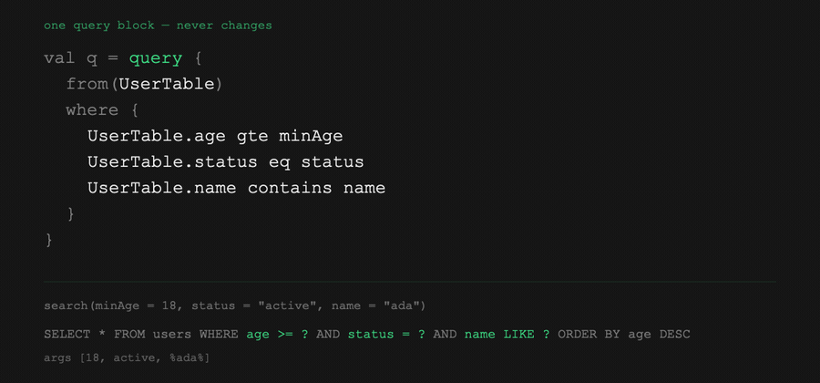

<p align="center">
  
</p>

<h1 align="center">RoomQL</h1>

<p align="center"><b>A type-safe Kotlin DSL for building dynamic Android Room queries at runtime — no raw SQL strings, no reflection, no 2ⁿ DAO methods.</b></p>

<p align="center">
  <a href="https://central.sonatype.com/namespace/io.github.kotplat.roomql"></a>
  <a href="https://github.com/KotPlat/RoomQL/actions/workflows/ci.yml"></a>
  <a href="LICENSE"></a>
  <a href="https://kotlinlang.org"></a>
  <a href="https://developer.android.com"></a>
</p>

<p align="center">
  <a href="#installation"><b>Install</b></a> &nbsp;·&nbsp;
  <a href="#minimal-working-example"><b>Quick start</b></a> &nbsp;·&nbsp;
  <a href="docs/USAGE.md"><b>Usage guide</b></a> &nbsp;·&nbsp;
  <a href="docs/API.md"><b>API reference</b></a> &nbsp;·&nbsp;
  <a href="#how-roomql-compares-to-the-alternatives"><b>Comparison</b></a> &nbsp;·&nbsp;
  <a href="#faq"><b>FAQ</b></a> &nbsp;·&nbsp;
  <a href="CHANGELOG.md"><b>Changelog</b></a>
</p>

---

Room has no good answer for a query whose filters are decided at runtime. Write it as a `@Query` string and you end up with `WHERE (:minAge IS NULL OR age >= :minAge)` repeated per filter, with column names the compiler never checks — rename a column and the query breaks *silently at runtime*. Write it as overloaded DAO methods and you need one method per filter combination, heading toward 2ⁿ. **RoomQL** builds the SQL programmatically instead: you keep Room's `@RawQuery`, a KSP processor generates a typed `Column<T>` for every column in your `@Entity` classes, and a `null` filter simply drops out of the generated SQL.

<p align="center">
  
</p>

<p align="center"><sub>One <code>query { }</code> block. As each filter goes <code>null</code>, its condition leaves the SQL — no <code>if</code> ladder, no <code>IS NULL OR</code>.</sub></p>

## Installation

Declare the version catalog entries (`gradle/libs.versions.toml`):

```toml
[versions]
roomql = "2.0.0"

[libraries]
roomql-runtime-android = { module = "io.github.kotplat.roomql:runtime-android", version.ref = "roomql" }
roomql-ksp-processor   = { module = "io.github.kotplat.roomql:ksp-processor",   version.ref = "roomql" }
```

```kotlin
plugins {
    id("com.google.devtools.ksp")
}

dependencies {
    implementation(libs.roomql.runtime.android)   // the .toQuery() bridge to Room; pulls in :runtime transitively
    ksp(libs.roomql.ksp.processor)                // generates the *Table objects
}
```

That's the whole dependency block for Android use — `:runtime-android` already depends on `:runtime` (the `query { }` DSL), so it comes along automatically. `ksp(...)` can't be folded into it: Gradle has no mechanism to pull an annotation/symbol processor transitively through `implementation`/`api`, so every KSP-based library (Room, Moshi, Hilt included) needs its own explicit `ksp(...)` line.

Add `io.github.kotplat.roomql:runtime` directly only if you want the DSL without the Room bridge — for example, unit-testing generated SQL on the plain JVM with no emulator. See [Modules](#modules) for what each artifact contains.

### Requirements

| Dependency | Version |
|---|---|
| Kotlin | 2.0.x |
| KSP | `2.0.21-1.0.28` |
| Room | 2.6.x – 2.7.x |
| Android | minSdk 21+ |
| JDK | 17 |

## Minimal working example

```kotlin
import androidx.room.Dao
import androidx.room.Entity
import androidx.room.PrimaryKey
import androidx.room.RawQuery
import androidx.sqlite.db.SupportSQLiteQuery
import com.roomql.android.toQuery
import com.roomql.runtime.SortDirection
import com.roomql.runtime.query

@Entity(tableName = "users")
data class UserEntity(
    @PrimaryKey val id: Int,
    val name: String,
    val age: Int,
    val status: String,
)
// KSP generates UserEntityTable in the same package.

@Dao
interface UserDao {
    @RawQuery
    fun search(q: SupportSQLiteQuery): List<UserEntity>
}

fun searchUsers(dao: UserDao, minAge: Int?, status: String?): List<UserEntity> {
    val q = query {
        from(UserEntityTable)
        where {
            UserEntityTable.age gteIfNotNull minAge      // dropped from the SQL when minAge is null
            UserEntityTable.status eqIfNotNull status    // dropped from the SQL when status is null
        }
        orderBy(UserEntityTable.age, SortDirection.DESC)
        limit(20)
    }
    return dao.search(q.toQuery())
}
```

`searchUsers(dao, 18, "active")` runs `SELECT * FROM users WHERE age >= ? AND status = ? ORDER BY age DESC LIMIT 20`.
`searchUsers(dao, 18, null)` runs `SELECT * FROM users WHERE age >= ? ORDER BY age DESC LIMIT 20`.
`searchUsers(dao, null, null)` runs `SELECT * FROM users ORDER BY age DESC LIMIT 20`.

No `if` ladders, no `IS NULL OR` trick, and `UserEntityTable.age` is a real Kotlin symbol — rename the property or the column and the code stops compiling.

## What you get

- **Compile-time safety on column references.** `UserEntityTable.age` is generated from your entity by KSP. Renames and typos fail the build instead of the query.
- **Optional filters that disappear, and say so.** `age gteIfNotNull minAge` drops the condition from the SQL when `minAge` is null; the plain `age gte minAge` is required and will not compile with a nullable value. Reading the operator name tells you which one you have.
- **A real DSL, not string concatenation.** `where`, `or { }`, `orderBy`, `limit`/`offset`, `groupBy`/`having`, `select`, `join`. Values are bound as positional `?` parameters, so there is no injection surface.
- **Aggregates and explicit projections.** `count`, `countAll`, `sum`, `avg`, `min`, `max` work in `having { }` and `orderBy`; `select(...)` projects them (or specific columns) instead of whole rows.
- **Automatic JOIN column aliasing.** Colliding column names across joined tables are aliased (`users.id AS users__id`) so a cursor never silently overwrites one column with another.
- **Works with Room's own `@RawQuery`.** The output is a plain `SupportSQLiteQuery`. Blocking, `suspend`, and `Flow` return types all work — Room does the rest.

## Documentation

RoomQL's reference documentation lives alongside the code, not on a separate site:

| Document | What it covers |
|---|---|
| **[Usage Guide](docs/USAGE.md)** | Every capability as a worked example — entities, `@RawQuery` DAOs, AND/OR, optional filters, joins, `Flow`, error handling, testing — with the SQL each one generates. |
| **[API Reference](docs/API.md)** | Every public type, function, and operator with its signature, generated SQL, and null-skipping behaviour. |
| **[Changelog](CHANGELOG.md)** | What shipped in each release. |
| **[Contributing](CONTRIBUTING.md)** | Build, test, and the `apiDump` step for public API changes. |

Per-module notes: [`:runtime`](runtime/README.md) · [`:runtime-android`](runtime-android/README.md) · [`:ksp-processor`](ksp-processor/README.md)

### Public API at a glance

RoomQL's entire public surface, across all three artifacts. Signatures, generic bounds, and the SQL each operator generates are in the **[API Reference](docs/API.md)**.

| Symbol | Artifact | What it does |
|---|---|---|
| [`query { }`](docs/API.md#query) | runtime | Entry point. Builds and returns a `RoomQlQuery`. |
| [`QueryBuilder`](docs/API.md#querybuilder) | runtime | Receiver inside `query { }`: `from`, `join`, `where`, `groupBy`, `having`, `select`, `orderBy`, `limit`, `offset`, `build`. |
| [`WhereScope`, `HavingScope`](docs/API.md#wherescope-and-havingscope-the-condition-operators) | runtime | Receivers inside `where { }` (`Column<T>`-only) and `having { }` (any `Expression<T>`, aggregates included). Both carry every operator below, plus `or { }` for alternatives. |
| `eq`, `notEq`, `gt`, `gte`, `lt`, `lte` | runtime | Comparisons. Required — a nullable value will not compile. |
| `eqIfNotNull`, `notEqIfNotNull`, `gtIfNotNull`, `gteIfNotNull`, `ltIfNotNull`, `lteIfNotNull` | runtime | The optional forms. Skip when the value is `null`. |
| `like`, `notLike`, `contains` | runtime | Text matching on `String` columns. Required. `contains` adds the `%` wildcards for you. |
| `likeIfNotNull`, `notLikeIfNotNull`, `containsIfNotNull` | runtime | The optional forms. Skip when the value is `null`. |
| `inList`, `notInList` | runtime | Set membership. Required — an empty list renders `IN ()`, which SQLite defines as matching nothing. |
| `inListIfNotEmpty`, `notInListIfNotEmpty` | runtime | The optional forms. Skip when the list is `null` or empty. |
| `between` | runtime | Range. Both bounds required — compose `gteIfNotNull` + `lteIfNotNull` for a half-open range. |
| `isNull`, `isNotNull` | runtime | SQL `NULL` checks — the two operators that never skip. |
| [`Column<T>`](docs/API.md#column) | runtime | A typed column reference. Generated per entity property, never hand-written. |
| [`count`, `countAll`, `sum`, `avg`, `min`, `max`](docs/API.md#aggregate-functions) | runtime | `Expression<T>` factories for `having { }`, `orderBy`, and `select`. `count`/`countAll` differ under a `LEFT JOIN`; `sum`/`avg` require a numeric column. |
| [`select`](docs/API.md#projections) | runtime | Projects specific columns/aggregates instead of whole rows. Switches off automatic JOIN-collision aliasing when present. |
| [`alias`](docs/API.md#projections) | runtime | Names an expression's output column for a multi-column `select(...)` with no `@RoomQlProjection` descriptor. |
| [`EntityTable`](docs/API.md#entitytable) | runtime | Implemented by every generated `*Table`: `tableName`, `allColumnNames`. |
| [`RoomQlQuery`](docs/API.md#roomqlquery) | runtime | The DSL's output: `sql` plus positional `args`. Pure JVM — assert on it in unit tests. |
| [`JoinType`](docs/API.md#jointype-and-sortdirection) / [`SortDirection`](docs/API.md#jointype-and-sortdirection) | runtime | `INNER`/`LEFT`, and `ASC`/`DESC`. |
| [`RoomQlException`](docs/API.md#roomqlexception) | runtime | Thrown by `build()` for an invalid query, with the reason in the message. |
| [`RoomQlQuery.toQuery()`](docs/API.md#comroomqlandroid--the-room-bridge) | runtime-android | Adapts the DSL output into the `SupportSQLiteQuery` Room's `@RawQuery` accepts. |
| [`roomql.tableSuffix`](docs/API.md#options) | ksp-processor | KSP option renaming the generated objects' `Table` suffix. |

## How RoomQL compares to the alternatives

| Approach | Column names checked? | Runtime-optional filters | Cost |
|---|---|---|---|
| **RoomQL** | Yes, via generated refs | Native — `null` drops the condition | Three artifacts, a `.toQuery()` call, no whole-query SQL validation |
| Room `@Query` string | No | `(:x IS NULL OR col = :x)` per filter | Room validates the whole SQL at compile time — a real advantage RoomQL gives up |
| Overloaded DAO methods | Via Room's `@Query` checking | One method per combination (2ⁿ) | Unmaintainable past a few filters |
| Hand-built `SimpleSQLiteQuery` | No — you concatenate strings | Manual `if` ladders | Zero dependencies; every injection and arg-ordering bug is yours |
| `SupportSQLiteQueryBuilder` (androidx.sqlite) | No — columns are strings | Manual | Already on your classpath; no type safety, no Room integration |
| [SQLDelight](https://github.com/sqldelight/sqldelight) | Yes — full SQL verified at compile time | Limited; dynamic shapes need generated variants or raw execution | You leave Room entirely and own the schema in `.sq` files |

**Use RoomQL when** you are staying on Room and have search-style queries whose filters are decided at runtime. **Do not use RoomQL when** your queries are static — a plain `@Query` gives you full compile-time SQL verification, which RoomQL cannot, because `@RawQuery` skips it by design. It is also the wrong tool if you need a query shape RoomQL does not build: `DISTINCT`, subqueries, or `UNION`.

## FAQ

### Does RoomQL replace Room?

No. RoomQL sits on top of Room and produces the `SupportSQLiteQuery` that Room's own `@RawQuery` methods take. You keep your `@Entity` classes, your `@Database`, your DAOs, and your migrations exactly as they are — RoomQL only replaces the SQL string for queries whose filters vary at runtime.

### How do I build a Room query with optional filters in Kotlin?

Wrap the filters in RoomQL's `query { }` block and use the `IfNotNull` operators for the ones that are optional: `where { UserEntityTable.age gteIfNotNull minAge }` emits `age >= ?` when `minAge` has a value and emits nothing at all when it is `null`. The plain `gte` requires a non-null value and will not compile against a nullable one — that split is what makes a `where { }` block tell you which of its conditions can disappear, just by reading the operator names. There is no `if` ladder and no `(:minAge IS NULL OR age >= :minAge)` trick, because the condition is never added to the SQL in the first place.

### Does RoomQL use reflection or runtime code generation?

No. RoomQL's KSP processor generates a `<EntityName>Table` object with a typed `Column<T>` per column at **build** time, and the runtime is a plain string builder over those references. Nothing is reflected over or generated while the app runs, so R8/ProGuard needs no extra keep rules. Column and table names are baked in as string literals, so obfuscation cannot change the SQL RoomQL emits — CI enforces this by scanning the published artifacts for reflection on every run.

### Is RoomQL safe from SQL injection?

Values are always bound as positional `?` parameters and passed to SQLite as an argument list — RoomQL never interpolates a user-supplied value into the SQL text. Table and column names come from generated code rather than user input. The one exception is the raw-string `from("table_name")` overload: never pass an untrusted string to it.

### Why are there three modules instead of one?

The DSL (`runtime`) is a pure-JVM module with no Android dependency, which is what lets you unit-test generated SQL on the JVM with no emulator or Robolectric. `runtime-android` is the thin Android bridge holding only `RoomQlQuery.toQuery()`, and `ksp-processor` runs at build time only. Splitting them keeps the Android dependency out of your test path — and in practice it costs you only two Gradle declarations, not three: `implementation(runtime-android)` already pulls in `runtime` transitively (see [Installation](#installation)).

### Does RoomQL work with Kotlin Multiplatform?

Not yet. `runtime` is a plain JVM module (not a KMP source set), and `runtime-android` depends on `androidx.sqlite`. RoomQL targets Android and JVM projects that use Room.

### Does RoomQL support KAPT?

No — RoomQL ships a KSP processor only, so your module needs the `com.google.devtools.ksp` plugin and `ksp(libs.roomql.ksp.processor)`. Room itself can still run on KAPT in the same module if you have not migrated it yet.

### Why doesn't my `Flow` re-emit when the table changes?

Room cannot infer which tables a raw query touches, so a `Flow`-returning `@RawQuery` must list them itself: `@RawQuery(observedEntities = [UserEntity::class])`. If that list is missing or names the wrong entity, the `Flow` emits once and then goes quiet. This is a Room requirement, not a RoomQL one.

### Does RoomQL validate my SQL at compile time?

Only the column references. RoomQL's KSP processor makes `UserEntityTable.age` a real Kotlin symbol, so a renamed or deleted column is a compile error — but Room's `@RawQuery` deliberately skips Room's static SQL verification, so a logically wrong query (a bad join predicate, a `groupBy` that does not match the projection) surfaces at runtime. For static queries, a plain `@Query` remains the safer choice.

## Pitfalls and limitations

Know these before adopting:

- **`IfNotNull` removes the condition — it does not mean "match `NULL`".** `status eqIfNotNull null` drops the filter; it is not `status IS NULL`. Use `isNull()` for that. The plain operators (`eq`, `gte`, …) will not compile against a nullable value at all, so this can only surprise you on the operator you asked to skip.
- **No compile-time SQL validation of the whole query.** Column references are checked; query logic is not. See the FAQ above.
- **JOIN results need matching `@ColumnInfo` names.** Colliding columns are aliased to `table__column`; your result class must use those exact names or the field will not map.
- **`Flow` `observedEntities` is manual.** Get it wrong and the `Flow` will not re-emit.
- **You must call `.toQuery()`.** The DSL output is a plain-JVM `RoomQlQuery`; `.toQuery()` (from `:runtime-android`) adapts it. One call at the DAO boundary is the price of an emulator-free test path.
- **Positional `?` args only.** No named parameters — a Room `@RawQuery` restriction.
- **`QueryBuilder` is not thread-safe.** Build a query on one thread or coroutine; never share a half-built builder.
- **Validation is deferred to `build()`.** Missing `from()`, a non-positive `limit`, `offset` without `limit`, and `having` without `groupBy` all throw `RoomQlException` at build time, not while you configure.
- **No `DISTINCT`, subqueries, or `UNION`.** `select(...)` covers explicit projections and aggregates; these three remain out of scope.
- **No auto-generated projection result classes yet.** A multi-column `select(...)` names its columns with the `alias` infix; a KSP-generated `@RoomQlProjection` descriptor that infers the names from a data class is tracked separately.
- **Room version range.** Targets Room 2.6.x–2.7.x (API 21+). Room 2.8 raised `minSdk` to 23; support is deferred.
- **No auto-generated JOIN result types.** You supply your own result class — by design, so you control its shape.

## Modules

| Module | Artifact | What it holds |
|---|---|---|
| [`:runtime`](runtime) | `io.github.kotplat.roomql:runtime` | the `query { }` DSL, `Column<T>`, conditions — pure JVM |
| [`:runtime-android`](runtime-android) | `io.github.kotplat.roomql:runtime-android` | `RoomQlQuery.toQuery()` → `SupportSQLiteQuery` |
| [`:ksp-processor`](ksp-processor) | `io.github.kotplat.roomql:ksp-processor` | generates the `*Table` objects from `@Entity` |

> **On annotation-driven integration.** RoomQL uses Room's manual `@RawQuery`: you declare the method, build with `query { }`, and pass `.toQuery()`. A zero-boilerplate annotation-driven integration was explored and dropped — KSP cannot read function bodies, so it could not infer the query or `observedEntities`. That exploration lives on the `development` branch and is tracked in issues [#6](https://github.com/KotPlat/RoomQL/issues/6) and [#13](https://github.com/KotPlat/RoomQL/issues/13). No release ships an annotation artifact yet.

## Contributing and support

Bug reports, feature requests, and questions all go to [GitHub Issues](https://github.com/KotPlat/RoomQL/issues). See [CONTRIBUTING.md](CONTRIBUTING.md) before opening a pull request, [CHANGELOG.md](CHANGELOG.md) for release notes, and [SECURITY.md](SECURITY.md) to report a vulnerability privately.

## License

Licensed under the [Apache License, Version 2.0](LICENSE). Copyright 2026 Ahmed Nobi.

You may use, modify, and redistribute this software (including commercially), provided you retain the copyright notice, the [`LICENSE`](LICENSE), and the [`NOTICE`](NOTICE) attribution, and state any changes you make.
